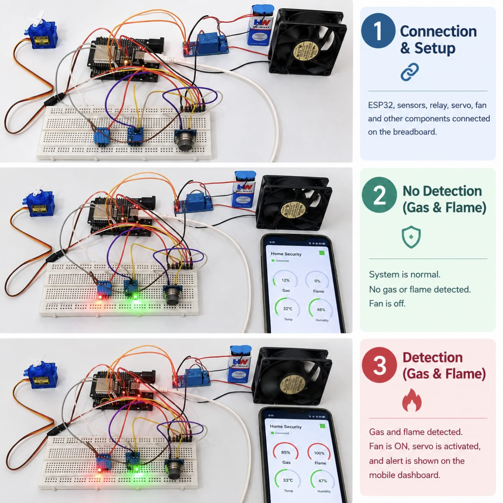

# 🏠 Edge Intelligence-Based Adaptive Home Automation and Security Alert System using TinyML & IoT

> An intelligent IoT-based home automation and security system that combines **Embedded Systems, TinyML, Edge AI, and IoT** to detect hazardous gas and flame conditions and automatically initiate safety responses.

---

## 📌 Project Overview

The **Edge Intelligence-Based Adaptive Home Automation and Security Alert System** is an intelligent safety and automation solution developed using an **ESP32 microcontroller, TinyML, IoT, and multiple sensors**.

The system continuously monitors the home environment for **gas leakage, smoke, flame, temperature, and humidity**.

A **TinyML classification model trained using Edge Impulse** is deployed directly on the ESP32 using a **quantized TensorFlow Lite model**. This enables the system to perform gas-related classification locally at the edge.

When a hazardous condition is detected, the system automatically responds by activating appropriate safety mechanisms such as an **exhaust fan, servo-controlled window, buzzer, and visual indicators**.

The system is also connected to a **Blynk IoT mobile dashboard**, allowing the user to monitor environmental parameters and security conditions remotely.

---

## 🎯 Objectives

The main objectives of this project are:

- To develop an intelligent home security and automation system using ESP32.
- To detect hazardous gas conditions using TinyML.
- To detect flame/fire using a flame sensor.
- To monitor temperature and humidity in real time.
- To perform AI-based decision-making directly at the edge.
- To automatically activate safety mechanisms during hazardous conditions.
- To provide remote monitoring through Blynk IoT.
- To reduce response latency through local processing.
- To integrate AI, IoT, sensors, and actuators into a single embedded system.

---

## 💡 Problem Statement

Conventional home safety systems often depend on simple threshold-based detection or cloud processing.

Threshold-based systems may not provide intelligent classification, while cloud-dependent systems can introduce communication delays and require continuous internet connectivity for decision-making.

Therefore, this project proposes an **edge-intelligent home safety system** where sensor data can be processed locally using **TinyML on an ESP32**, while IoT connectivity is used for remote monitoring and notification.

---

## 💭 Proposed Solution

The proposed system combines:

**Embedded Systems + TinyML + IoT + Sensors + Automation**

The ESP32 acts as the central controller.

The MQ-2 sensor monitors gas/smoke conditions, while a flame sensor detects fire. The DHT11 sensor measures temperature and humidity.

The gas-related sensor data is processed using a TinyML classification model deployed on the ESP32.

When a hazardous condition is detected, the system automatically activates the required safety mechanism.

---

# 🧩 System Architecture

```text
                         ┌─────────────────────┐
                         │        ESP32        │
                         │  Main Controller    │
                         └──────────┬──────────┘
                                    │
              ┌─────────────────────┼─────────────────────┐
              │                     │                     │
              ▼                     ▼                     ▼
       ┌─────────────┐       ┌─────────────┐       ┌─────────────┐
       │ MQ-2 Gas    │       │   Flame     │       │   DHT11     │
       │   Sensor    │       │   Sensor    │       │   Sensor    │
       └──────┬──────┘       └──────┬──────┘       └──────┬──────┘
              │                     │                     │
              ▼                     ▼                     ▼
       ┌─────────────┐       ┌─────────────┐       Temperature
       │   TinyML    │       │    Fire     │       & Humidity
       │Classification│      │  Detection  │        Monitoring
       └──────┬──────┘       └──────┬──────┘
              │                     │
              └──────────┬──────────┘
                         │
                         ▼
                ┌──────────────────┐
                │ Safety Decision  │
                └────────┬─────────┘
                         │
             ┌───────────┼───────────┐
             │           │           │
             ▼           ▼           ▼
       ┌──────────┐ ┌──────────┐ ┌──────────┐
       │  Relay   │ │  Servo   │ │  Buzzer  │
       │   Fan    │ │  Window  │ │  Alert   │
       └────┬─────┘ └────┬─────┘ └──────────┘
            │             │
            ▼             ▼
       Exhaust Fan    Window Opens
                         │
                         ▼
                 ┌─────────────────┐
                 │    Blynk IoT     │
                 │ Mobile Dashboard │
                 └─────────────────┘
## 📸 Project Demonstration


